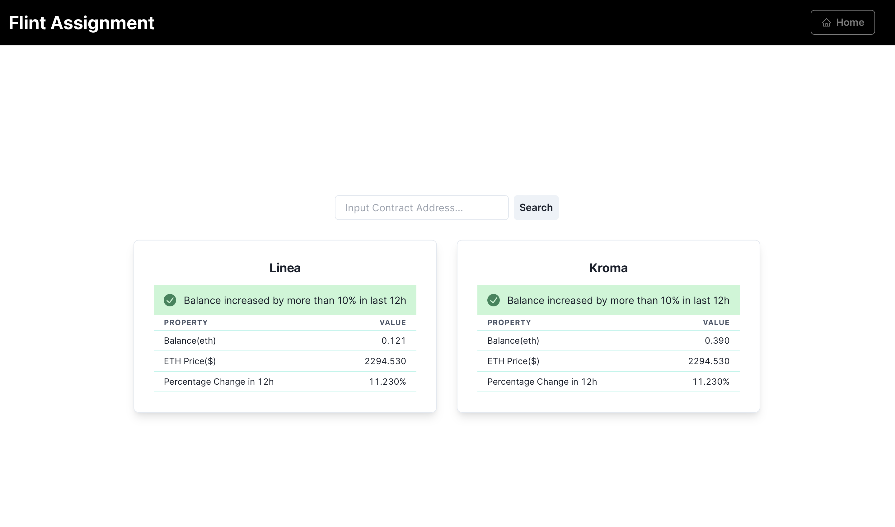

# Wallet Balance Tracker


This project is a simple Next.js application that fetches and displays the balances of various wallet addresses. It provides a clean and organized presentation of wallet balances, allowing users to easily track their assets.

## Getting Started

1. **Clone the repository:**

    ```bash
    git clone https://github.com/Nitin-Rana/wallet-balance-tracker.git
    cd wallet-balance-tracker
    ```

2. **Install dependencies:**

    ```bash
    npm install
    # or
    yarn install
    # or
    pnpm install
    # or
    bun install
    ```

3. **Run the development server:**

    ```bash
    npm run dev
    # or
    yarn dev
    # or
    pnpm dev
    # or
    bun dev
    ```

    Open [http://localhost:3000](http://localhost:3000) in your browser to view the application.

    You can start editing the page by modifying `app/page.tsx`. The page auto-updates as you edit the file.

    This project uses [`next/font`](https://nextjs.org/docs/basic-features/font-optimization) to automatically optimize and load Inter, a custom Google Font.

## Features

- Fetch and display balances of various wallet addresses.
- Clean and responsive table layout for better readability.
- Add new chains.
- Data gets updated in real time.

# [IMPORTANT]
- The repo uses [`Coin Paprika API`](https://api.coinpaprika.com) to get the value changes in the given token in last 12 hour.
- It sometimes stops working so please refer to the working to see the working of the webapp.
- The project uses no separate backend so all the keys and wallet addresses are in exposed condition as I wanted the user to add their own addresses to the code.


